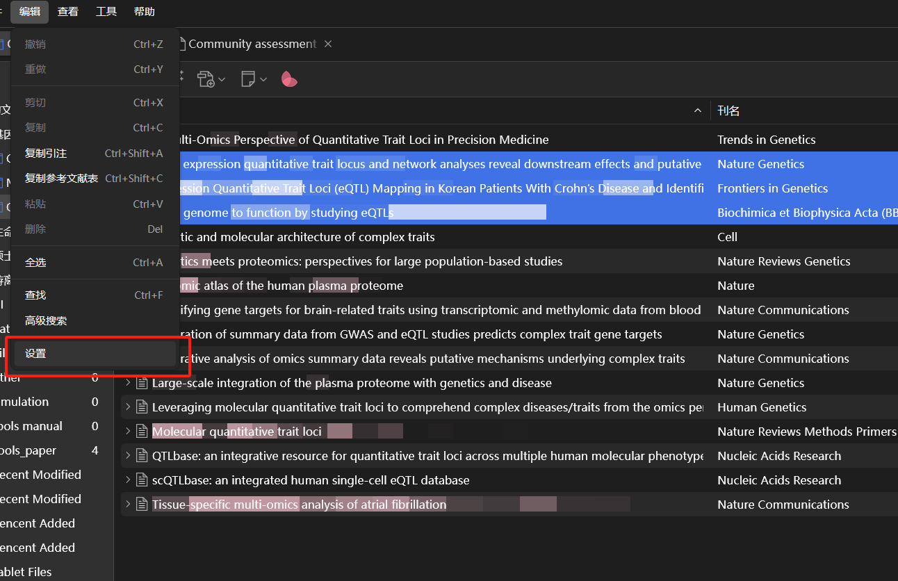

# Zotero插入引文（国科大格式）

<mark style="color:yellow;">**先把需要的文献导入喔**</mark>

虽然Zotero自带很多引用的样式，但仔细看还是感觉怪怪的。比如这个GB/T 7714-2015的格式，当作者有多位时，显示的是一个“英文名字+‘ ’+‘等’”，比如这里展示的<mark style="color:orange;">**CHU 等, 2022。**</mark>

<figure><figcaption></figcaption></figure>

果壳的要求是这样的：

<figure><figcaption></figcaption></figure>

找到一个网站，里面有很多引文格式：[https://zotero-chinese.com/styles/](https://zotero-chinese.com/styles/)

<figure><figcaption></figcaption></figure>

找到对应的格式

<figure><figcaption></figcaption></figure>

按照说明下载，在Zotero中添加即可。

<figure><figcaption></figcaption></figure>

<figure><figcaption></figcaption></figure>

<figure><figcaption></figcaption></figure>

添加之后可以进行样式预览：

<figure><figcaption></figcaption></figure>

插入参考文献之后在末尾生成文献列表，需要点击“Add/Edit Bibliography”

<figure><figcaption></figcaption></figure>

插入的参考文献都是以域代码的形式存在于Word文档中的，之前遇到过打开乱码的情况，所以个人建议：

<mark style="color:red;">全部编辑完之后在word里面去除引用之间的链接（去除之后如果对引用再进行改动，这些是不会自动更新的，</mark><mark style="color:purple;">**建议另存一份，另存一份，另存一份！！！！！！！**</mark><mark style="color:red;">）</mark>

<figure><figcaption></figcaption></figure>
