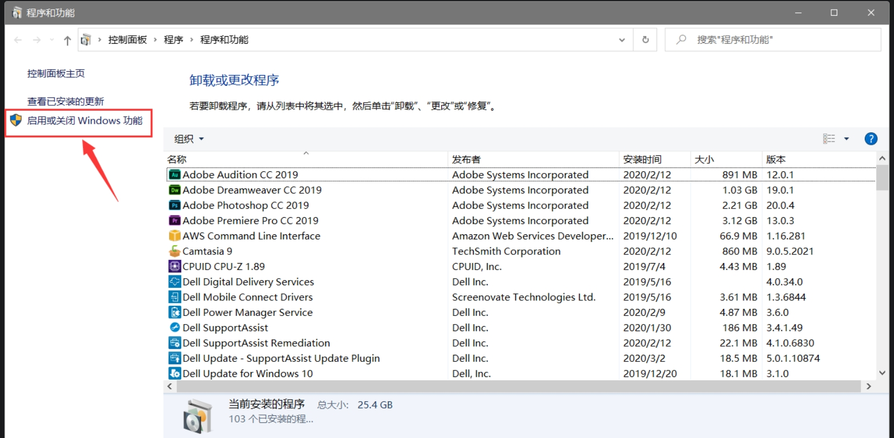
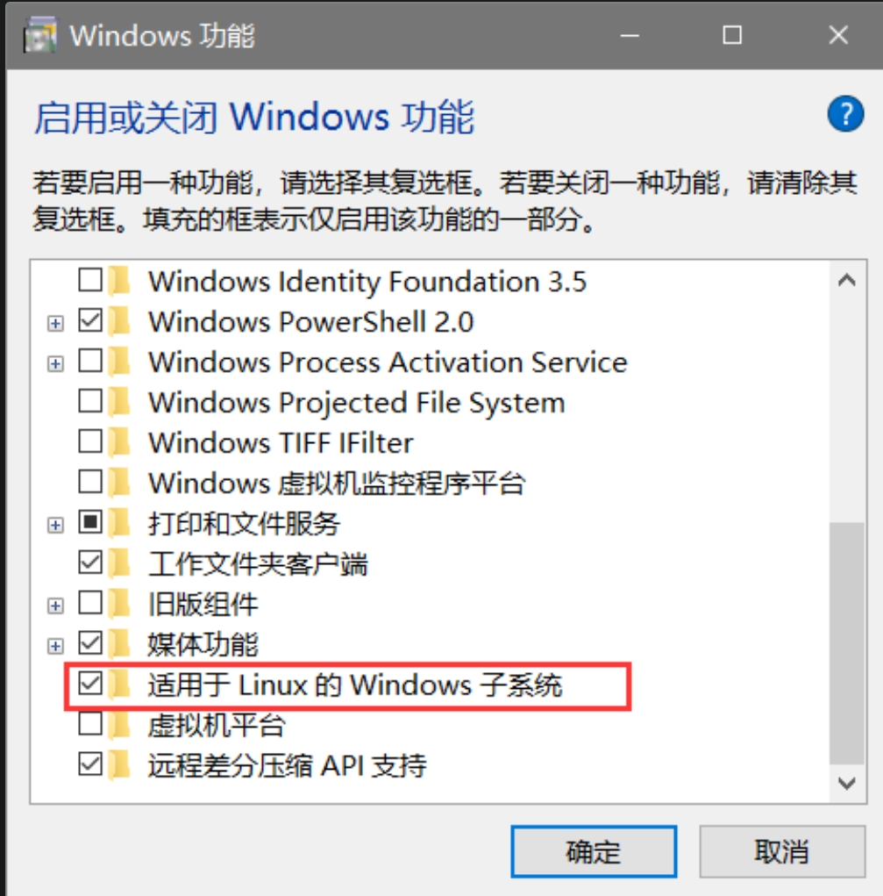
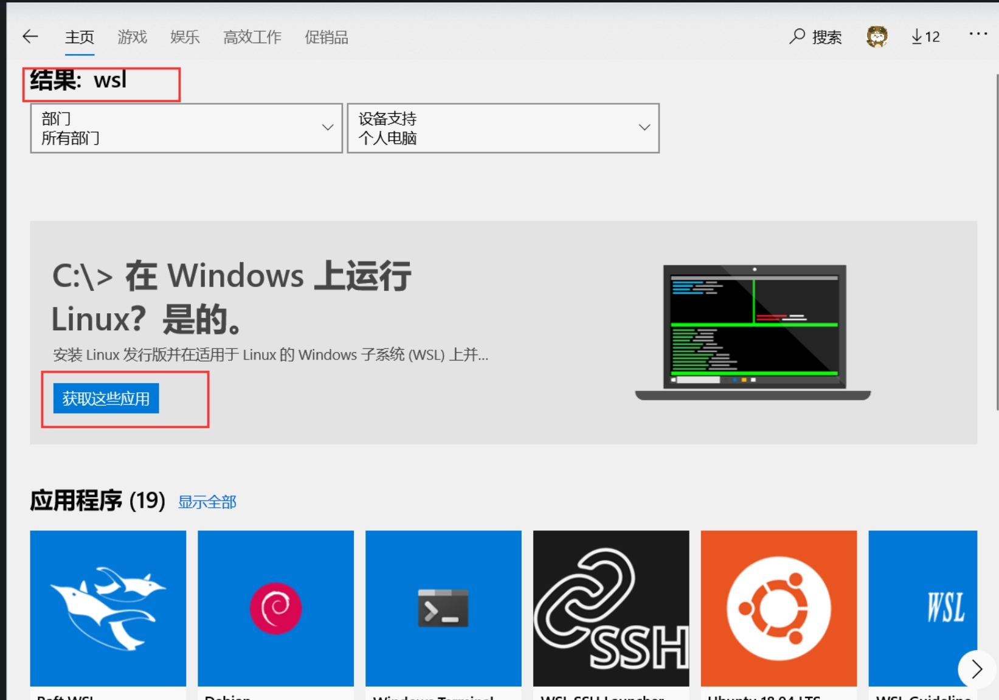
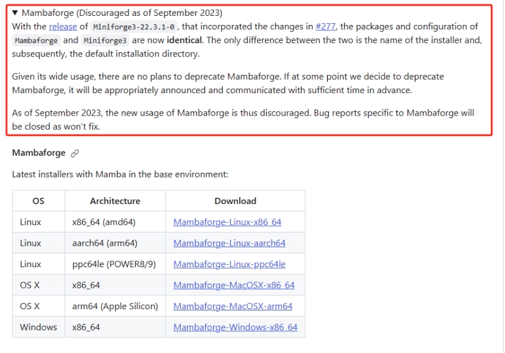

# 准备工作

## Linux环境

对于Linux环境，如果是MacOS或者Linux系统，可以直接使用系统自带的终端，如果是Windows系统，可以使用Windows的子系统，或者使用虚拟机安装Linux系统，下面分别介绍这三种方法。 像一些小的数据或者是自己用来练习的数据，可以直接在本地进行处理，但是如果是大数据，或者是需要长时间运行的程序，就需要在服务器上进行处理，这里推荐使用服务器，因为服务器的配置比较高，而且可以长时间运行，不会像本地电脑一样，运行一段时间就会出现卡顿的情况。 ~~还有一个原因，毕竟是服务器嘛，公家的东西不用白不用。~~

1. 登陆服务器
2. 安装虚拟机
3. Windows安装子系统

### 登陆服务器

无论是Windows还是MAcOS，都可以使用ssh登陆服务器。 `ssh username@serverip -p 22`其中username是你的用户名，serverip是服务器的ip地址，-p 22是端口号，如果是默认的端口号，可以不用加这个参数。 如果是Windows系统，可以直接打开PowerShell，输入,就像下面这样：

```
Windows PowerShell
版权所有（C） Microsoft Corporation。保留所有权利。

安装最新的 PowerShell，了解新功能和改进！https://aka.ms/PSWindows

PS C:\Users\10696> ssh username@192.168.61.10 -p 22
(username@192.168.61.10) Password:
(username@192.168.61.10) Verification code:
Last login: Wed Nov 22 20:11:31 2023 from 172.18.160.229
Rocks 7.0 (Manzanita)
Profile built 15:01 19-Jul-2018

Kickstarted 15:19 19-Jul-2018
[username@xxx-login-0-10 13:44:28 (#╯°Д°)╯︵┻━┻ ~]$
```

这样就登陆成功了，如果是第一次登陆，会提示你是否要接受服务器的公钥，输入yes就可以了。 如果是Macos操作是一样的,~~**可惜我没Mac。**~~ 除了电脑自带的终端，还有一些好用的第三方终端，如：

1. [Tabby](https://tabby.sh/)
2. [Xshell](https://www.netsarang.com/en/xshell/)
3. [MobaXterm](https://mobaxterm.mobatek.net/)

......

**PS:** 我们公司是由很多节点的，登陆节点、软件节点、计算节点、测试节点等，不同的节点有不同的用处。登陆的时候是处于登陆节点下，顾名思义这个节点仅是用来登陆的，非常脆弱所以不要在这里跑什么任务，小心被同事在群里死亡大点名。  

因此登陆进集群之后赶紧通过命令`ssh cngb-xcompute-#-#`换到测试节点，在里面做一些日常任务。如果需要跑任务，可以通过命令`qsub`提交任务到计算节点，这样就可以在计算节点上跑任务了，后面会讲。  

软件节点就是用来安装软件的，但是这个网速中真的非常非常慢，真的服气。
### 安装虚拟机

这个我个人觉得不大方便，如果想安装的话可以参考这篇推文:[超详细的VMware虚拟机安装Linux图文教程保姆级](https://blog.csdn.net/weixin\_61536532/article/details/129778310)

### Windows安装子系统

这里推荐使用Ubuntu子系统，因为Ubuntu子系统的安装比较简单，而且使用起来也比较方便。且推荐安装在D盘，因为D盘的读写速度比较快，而且不会占用C盘的空间。 我使用的方法是在微软商店中安装，之后再迁移到D盘中。 **安装子系统：**

1.  打开控制面板

    <figure><figcaption></figcaption></figure>
2.  打开相关设置

    <figure><figcaption></figcaption></figure>
3.  微软商店搜索wsl安装合适的版本

    <figure><figcaption></figcaption></figure>
4.  安装完成后，打开子系统，输入用户名和密码，就可以使用了。

    <figure><figcaption></figcaption></figure>

**迁移D盘：** [迁移wsl2子系统文件目录](https://juejin.cn/post/7024498662935904269)

## 虚拟环境配置
生信分析会涉及很多软件，不同软件要求的环境配置也不一样，就好比有些软件需要python 2 但有些软件需要python 3，中国有句古话，叫做~~识时务者为俊杰~~“鱼与熊掌不可兼得”，就需要我们根据不同的软件配置不同的环境。

就好像在一个大房子里有很多不同的屋子，每个屋子之间相互独立，彼此之间互不影响，当用到不同的软件时就进到不同的屋子里。

### mamba安装
我个人感觉哈，mamba和从conda实际上是差不多的，都是包管理软件，都能创建虚拟环境，且mamba的速度比conda快很多。安装mamba的时候也会安装上conda，因此，如果不想安mamba，也可以直接看后面的教程安conda，这里讲一下如何安装mamba。

mambaforge不在鼓励使用了，因此我们通过miniforge来安装。
> https://github.com/conda-forge/miniforge

 <figure><figcaption></figcaption></figure>

 #### 安装Miniforge3
 > https://github.com/conda-forge/miniforge/releases
```shell
#1下载miniforge
wget https://github.com/conda-forge/miniforge/releases/download/23.3.1-1/Miniforge3-Linux-x86_64.sh
#安装mamba
sh Miniforge3-Linux-x86_64.sh
#刷新
source ~/.bashrc
#添加软件源
conda config --add channels bioconda
#直接使用mamba
mamba
```
#### mamba安装软件
```shell
mamba install -y fastqc 
mamba install -y fastp
mamba install -y multiqc
mamba install -y seqkit
mamba install -y kraken2 
mamba install -y krakentools 
mamba install -y bracken 
mamba install -y bowtie2 
mamba install -y samtools
mamba install -y krona
```
其他的命令都和conda一致，可以参考下面的conda教程。  

### conda环境配置
conda 是一个开源的软件包管理系统和环境管理系统，用于安装多个版本的软件包及其依赖关系，并在它们之间轻松切换。 Conda 是为 Python 程序创建的，适用于 Linux，OS X 和Windows，也可以打包和分发其他软件。  

conda分为anaconda和miniconda。anaconda是包含一些常用包的版本（这里的常用不代表你常用 微笑.jpg），miniconda则是精简版，需要啥装啥，所以推荐使用miniconda。

#### conda安装

```shell
wget -c https://mirrors.tuna.tsinghua.edu.cn/anaconda/miniconda/Miniconda3-latest-Linux-x86_64.sh
## 当然因为集群的网速很慢，也可以直接去官网下载，然后上传到服务器上，再运行后面的命令
chmod 777 Miniconda3-latest-Linux-x86_64.sh #给执行权限
bash Miniconda3-latest-Linux-x86_64.sh #运行
```

#### conda换源

```shell
conda config --add channels https://mirrors.tuna.tsinghua.edu.cn/anaconda/pkgs/free/
conda config --add channels https://mirrors.tuna.tsinghua.edu.cn/anaconda/pkgs/main/
conda config --add channels https://mirrors.tuna.tsinghua.edu.cn/anaconda/cloud/conda-forge/
conda config --add channels https://mirrors.tuna.tsinghua.edu.cn/anaconda/cloud/bioconda/
```
#### 其他命令
```shell
// 显示安装的频道
conda config --set show_channel_urls yes 
// 查看已经添加的channels
conda config --get channels
// 已添加的channel在哪里查看
vim ~/.condarc
```
#### 利用conda安装生物信息软件
```shell
conda search gatk
conda install gatk
which gatk
// 如需要安装特定的版本:conda install 软件名=版本号
conda install gatk=3.7
// 这时conda会先卸载已安装版本，然后重新安装指定版本。
// 查看已安装软件:
conda list
// 更新指定软件:
conda update gatk
// 卸载指定软件:
conda remove gatk
```
#### 利用conda创建、删除虚拟环境
之前创建的时候显示的是（base）这是conda的基本环境，有些软件依赖的是python2的版本，当你还是使用你的base的时候你的base里的python会被自动降级，有可能会引发别的软件的报错，所以，可以给一些特别的软件一些特别的关照，比如创建一个单独的环境。
在conda环境下，输入`conda env list`（或者输入`conda info --envs`）查看当前存在的环境

```shell
#创建虚拟环境
conda create -n py2 python=2
conda create -n py3 python=3
conda activate py2
which python
python --version
conda deactivate
conda activate py3
which python
python --version
#删除虚拟环境
conda remove -n myenv --all
```

## Jupyter 安装
### 通过condan安装
像我们平常安装软件一样，我们可以通过conda来安装jupyter，里我们以JupyterLab为例。  
>[!IMPORTANT]  
>1. 注意切换到软件安装节点
>2. 安装时进入相应环境

```shell
conda install anaconda::jupyterlab
```
**（理想状态下）** 完成安装之后运行命令，将对应的链接粘贴到本地浏览器即可：
```shell
jupyter-lab --jupyter-lab --no-browser --port=8890 --ip=0.0.0.0
```
但是，我们现在是在公司的集群上进行安装的，如果想通过本地访问，还需要将集群上的`8890`端口映射到本地。
**而且！而且！我们想在计算节点上使用的话还需要连续映射两次**，即`本地<->login节点<->计算节点`
这时候需要我们在本地打开终端，在里面输入以下内容：
```shell
ssh zhangyifan1@<login节点ip> -L 127.0.0.1:8890:127.0.0.1:8890
```
随后便会进入登录节点，这个时候还需要建立一次映射：
```shell
ssh zhangyifan1@<计算节点ip> -L 8890:127.0.0.1:8890
```
这样我们就将计算节点的8890端口和我们本地的8890端口映射起来了，再次运行`jupyter-lab`命令激活jupyter，将给出的链接复制到本的浏览器即可访问。
## 参考：
1. <https://mp.weixin.qq.com/s/y4dwHgH8p_FGQm6_naDwXg>
2. <https://cloud.tencent.com/developer/article/1617342>
3. <http://47.57.89.98/detail/15/>